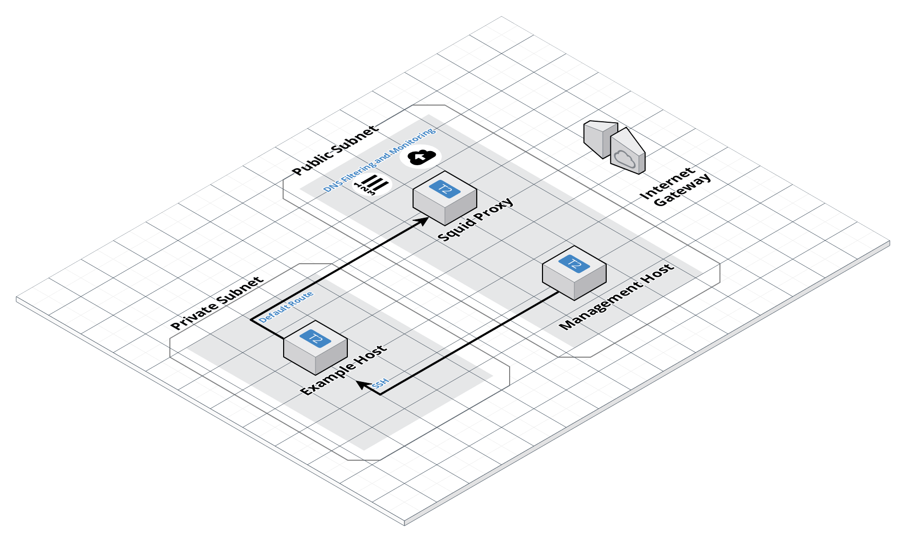

# aws-proxy-pattern

## Description

A fairly common security best practice is to send outbound internet traffic
through a proxy to facilitate monitoring and filtering. Transparent proxies
make this easier by not requiring any specific configuration on the hosts.

This repository contains terraform modules to create such a proxy with an
example network in AWS VPC to show how it works.

The blog article related to this repo can be found at:

https://www.nearform.com/blog/building-a-transparent-proxy-in-aws-vpc-with-terraform-and-squid/

## Building

1. `terraform init` in the project root
2. Change the `provider.tf` profile if necessary to match your
   `~/.aws/credentials` profile name if it is not `default`.
3. Create a new EC2 key pair or use an existing one and provide the key pair
   name to terraform as a variable, this will be used to protect access to the
   instances in the example network. An easy way to do this is to add a file
   called `terraform.tfvars` to the root of the project containing the line:
   `key_pair_name = "<your_key_pair_name_here>"`
4. `terraform plan`
5. `terraform apply`

## Testing

Use the IP addresses output by terraform to SSH into the example host through
the management host. Ensure you have SSH agent forwarding on to make this work,
see the blog article for specific steps.

Running `curl http://www.amazonaws.com` and `curl http://baddomain.com` should
show that traffic is going through and being filtered by the proxy. This can be
further verified over SSH to the proxy directly by tailing
`/var/log/squid/access.log`.

## License

Copyright nearForm Ltd 2018. Licensed under [Apache 2.0 license](LICENSE)

## Contributing

We have a [contributing guide](CONTRIBUTING.md) and a [code of conduct](CODE_OF_CONDUCT.md).
